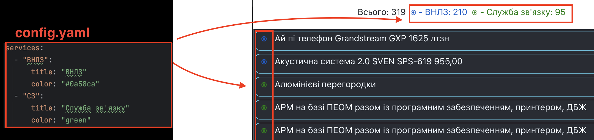
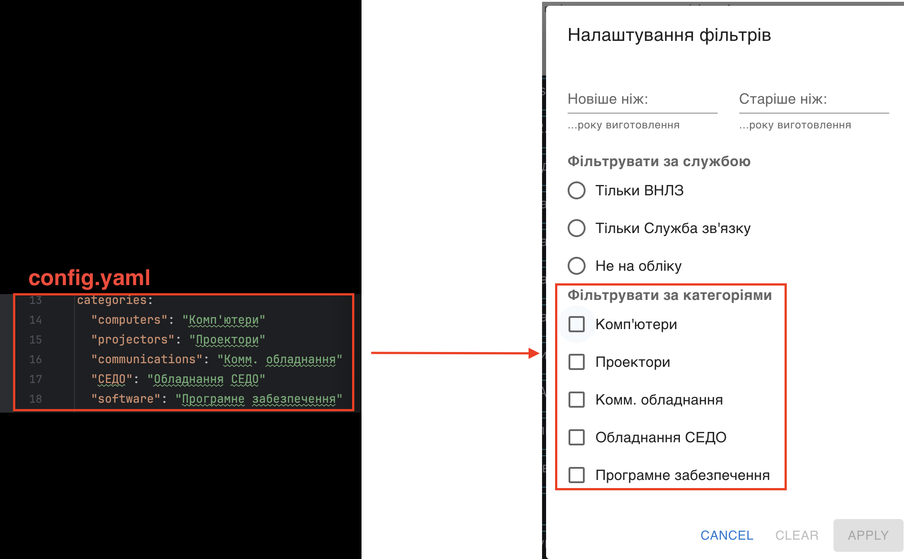

# ItemsManager

Це застосунок управління майном для внутрішнього користування. Є швидкий пошук, фільтрація та експорт майна, є можливість додавання нотаток або корисних деталей про матеріальні цінності.


## Головні особливості

Цю програму було створено як інструмент внутрішнього використання для керування майном – швидко знаходити елементи, робити для них важливі нотатки, сортувати та фільтрувати відповідно до найпоширеніших запитів у моєму відділі – наприклад, знайти мені все майно, старіше за 2014 рік.

Пошук працює за назвою або за інвентарним номером.

Кожен авторизований користувач може шукати, фільтрувати та експортувати список, робити нотатки, додавати нові атрибути, або створювати елементи. Але лише авторизований адміністратор (root) може додавати користувачів або видаляти елементи.

Неавторизований користувач не має жодного доступу і не може бачити список майна.

## Прийняті рішення

Mongo DB було обрано, оскільки тут немає суттєвих зв’язків між елементами, і здебільшого ці елементи можуть мати різні властивості, оскільки інформація про них надходить з різних відділів, де вони зберігалися у таблицях xls, а ці таблиці мали різні заголовки.

# Розгортання та запуск

#### 1. Склонуйте репозиторій:
   
 ```git clone https://github.com/dmytro-ustynov/ItemsManager.git``` 
 
 
#### 2. Створіть `.env` файл за прикладом шаблону `.env.example`:

 ```cp .env.example .env```
 

#### 3. Заповніть пусті значення в `.env` файлі -- паролі доступу до БД та секреті. Доречі, ви можете створити рандомну строку для секрету або паролів за допомогою такої команди:

```
openssl rand -base64 12 
# This will output smth like: WvWG/9DFiENuJStn 
```

#### 4. Заповніть `config.yaml` - впишіть сюди ті служби, які ви будете мати серед свого майна. Ви можете додавати свої служби, або видалити ті що в прикладі. Налаштуйте кольори для приємнішого відображення списку, використовуйте назви кольорів як прийнято в css , або hex номери. Наприклад:

   * <span style="color:wheat;"> ⦿ "wheat"</span>
   * <span style="color:green;"> ⦿  "green"</span>
   * <span style="color:#0a58ca;"> ⦿ "#0a58ca"</span>
   * <span style="color:#90afea;"> ⦿ "#90afea"</span>
   
   
<details>
  <summary>Для чого потрібний 'config.yaml' та що означають ці налаштування?</summary>
  
#### Секція "services"

Ця секція описує як буде виглядати перелік елементів. Вона визначає служби, які є у Вашій організації. Ви можете додавати нові служби або видаляти (перейменовувати) існуючі в файлі `config.yaml`. Служби використовуються для категоризації елементів у списку. Колір служби використовується для представлення служби у списку. Ви можете використовувати назви кольорів css або шестнадцяткові числа.



#### Секція "categories"

Ця секція описує як буде виглядати модальне вікно **Фільтрувати**. Вона визначає категорії, які ви можете використовувати для фільтрації елементів у списку. Ви можете додавати нові категорії або видаляти (перейменовувати) існуючі в файлі `config.yaml`. Якщо ви хочете, щоб фільтри працювали належним чином, елементи в БД повинні мати атрибут 'category'. Значення 'category' повинно бути таким самим, як ключі в розділі 'categories' файлу `config.yaml` (тобто "computers", "projectors" і т.д.). Тоді значення будуть назвами для прапорців (чекбоксів), тобто "Комп'ютери", "Проектори" і т.д. 



В базі даних поле category може бути написано через кому, тоді даний елемент буде відображатися в кількох категоріях одночасно.

Приклад:
```json
"category": "СЕДО, computers"
```

Частина фільтрів із радіо-кнопками відображається в модальному вікні фільтрування відповдно до переліку служб, які ви вказали в файлі `config.yaml`. 
</details>
    
#### 5. Після налаштування служб в файлі `config.yaml` перейдіть в директорію  `server` та  виконайте команду:

`python generate_static.py`

Це створить необхідні серверні директорії і додасть необхідні налаштування для клієнтської частини програми, а саме файли  `generated.css` та `generated_constants.js`.

```bash
python /server/generate_static.py 
Generating css in /Users/dmytroustynov/programm/ItemsManager/server...
file saved: ../client/src/generated.css
Generating js... 
file saved: ../client/src/generated_constants.js
Static generated successfully!  
```

Кожного разу як ви змінюєте файл `config.yaml` вам слід виконати цю команду, щоб застосувати зміни до клієнтської частини програми.

#### 6. Створіть та підніміть контейнери за допомогою команди:

`docker-compose up -d --build`

Це займе деякий час, по завершенню Ви маєте побачити щось подібне:
```
Creating items-db ... done
Creating items-server ... done
Creating items-client ... done
```

#### 7. Все працює! Перейдіть за посиланням http://localhost і ви побачите працюючий застосунок, але поки що в ньому немає користувачів та список порожній.


#### 8. Створіть користувача root http://localhost:5000/docs#/user/user_signup_user_signup_post. 
 - Перейдіть за цим посиланням та створіть користувача із іменем "root". натисніть кнопку **Try it out** та впишіть в поле дані, напроти поля _password_ впишіть бажаний пароль.
Це потрібно зробити Вам лише раз. Запамʼятайте пароль користувача root, він потрібний для управління іншими користувачами
```json
{
   "username" :"root", 
   "password": "your_password_here"
}
 ``` 

   

_ПРИМІТКА_: Обовязково створіть "**root**" користувача! Тільки користувачі з іменами "**root**" та "**admin**"  створюються активованими по замовчуванню. 

"**root**" користувач має ультимативні права доступу: може активувати та деактивувати користувачів, видаляти їх, встановлювати їх пароль, а також редагувати та видаляти нові елементи майна.

"**admin**" користувач може тільки переглядати список майна, робити пошук, фільтрувати та експортувати список. Але в нього немає прав на керування користувачами або на видалення елементів як у **root**. Будь який інший новий користувач створюється неактивним за замовчуванням, і його потрібно буде активувати з-під акаунту **root**. Після активації він отримає права доступу як у **admin**.


#### 9. Завантажте список майна до бази даних. Ви можете завантажити його напряму , або скористатися масовою загрузкою, або створювати елементи, додаючи їх по одному.


Для того щоб завантажити напряму в базу даних, Вам треба підключитися до неї за допомогою сторонньої програми, типу _MongoDB Compass_ або  _Robo 3T_ використовуючи імя та пароль, що ви прописали в файлі `.env`. Після підключення до бази даних завантажте елементи в колекцію **"ITEMS"**.


#### 10. Підготуйте таблицю xls  із даними майна, яке ви хочете додати. Лише ці поля (колонки) є обовязковими:
- Найменування
- Інвентарний номер
- Служба

Тож створіть  `xls` файл, що матиме такі стовпчики. Перший рядок цього файлу буде сприйматися як шапка, і назви атрибутів будуть братися звідси.  Починаючи із другого рядка кожний рядок до першого пустого буде ввжатися одним елементом, що додається із відповідними атрибутами. Кожний рядок – це новий елемент. Пусті значення в рядках дозволяються, окрім стовпчика **"Найменування"**. Як тільки буде знайдена пуста перша клітинка – це розцінюється як кінець таблиці.

Зверніть увагу, в стовпчику `"Служба"` варто вписувати саме такі назви служби як ви додавали в налаштуваннях в файлі `config.yaml` file. Це потрібно для коректного відображення в тих кольорах, що ви налаштували.

В файлі ексель ви можете додати будь які інші потрібні Вам стовпчики (властивості) майна.

#### 11. Скористайтеся пунктом меню "Масова загрузка із Excel".

   Після вибору файлу він буде проаналізований і буде видано повідомлення такого вигляду:
   
  Натисніть "**ЗАВАНТАЖИТИ**" і дані із файлу будуть додані до бази даних. 

